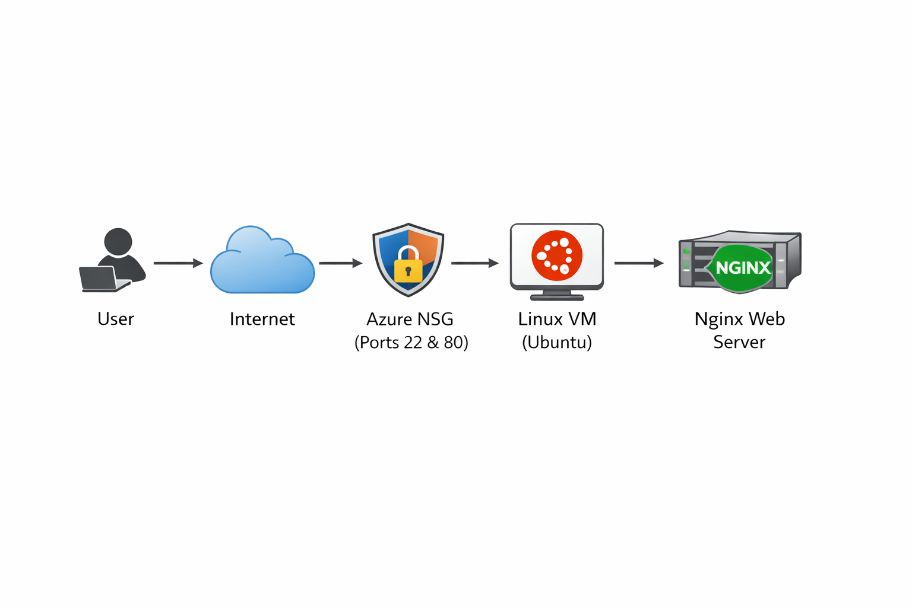

# 🟢 Azure Linux Web Deployment

This project demonstrates deploying a simple web application on Azure Cloud using an Ubuntu Linux VM.
It uses Nginx to host a custom HTML webpage and enables secure remote access via SSH.
The VM is protected using NSG rules for SSH and HTTP access, and monitored using Azure Monitor.
This is a real-world example of basic cloud deployment and web hosting on Azure.

## 🚀 Features
- 🔐 SSH-based secure access
- 🌐 Nginx web server deployment
- 📄 Custom web page hosted on Ubuntu VM
- 📈 Azure Monitor (VM Insights) for basic performance monitoring
- 🛡️ Network security with NSG rules (SSH & HTTP)

## 🧱 Architecture Diagram

## 🧰 Tech Stack

| Category       | Tech                             |
| -------------- | -------------------------------- |
| Cloud Provider | Azure                            |
| OS             | Ubuntu 20.04 / 22.04             |
| Web Server     | Nginx                            |
| Monitoring     | Azure Monitor (VM Insights)      |
| Access         | SSH (Port 22) & HTTP (Port 80)   |

## 🛠️ Setup Commands (Linux VM)

1. Update package list
   - sudo apt update

2. Install Nginx
   - sudo apt install nginx -y

3. Open the web directory
   - cd /var/www/html

4. Edit index.html
   - sudo nano index.html

5. Restart Nginx
   - sudo systemctl restart nginx

6. Check Nginx status
   - sudo systemctl status nginx

## 🧩 Project Steps Completed
1. Created Azure Resource Group: rg-azure-web-project
2. Deployed Ubuntu Linux VM 
3. Configured NSG for SSH (22) and HTTP (80)
4. Installed Nginx web server
5. Deployed custom HTML page
6. Enabled Azure Monitor (VM Insights) for CPU & network monitoring
7. Captured screenshots for each step

## 📷 Screenshots
See the screenshots folder for proof of each step.

## 🔗 Live Demo
Open in browser:
http://172.188.68.0/

